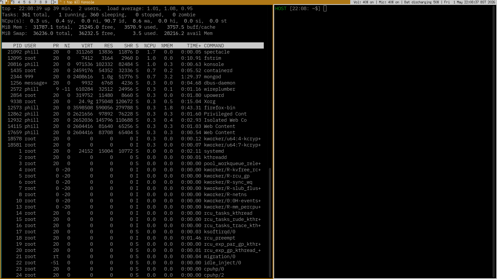

# Phill's Custom Build of DWM #

dwm is a minimal tiling window manager for X11.

It was created by suckless. The homepage is here: https://dwm.suckless.org/

I forked the dwm repo in 2013 and applied a few custom patches:

1. Bright thick yellow borders
2. pertag diff
3. (I forget, maybe a.. ) terminal gap diff
3. Hardcoded keybindings for many scripts

I have used this interface 35 hours a week for 13+ years.

I recently used Augment and Opus 4.7 to rewrite the codebase in Rust.

How to use this build of dwm:

ctrl + shift + q = exit dwm (return to login screen)

alt + p = open dwm to run a new command
alt + shift + enter = open a new terminal (~/bin/konsole)

alt + j or alt-k = cycle through open windows on the current desktop
alt + enter = swap the primary and secondary windows.

alt + 1, alt + 2, alt + 3 = cycle through desktops
alt + shift +1 etc = move window to new desktop
alt + 0 = all windows on a single desktop

alt + m, alt + t = switch desktop between single app/tiling layout modes
alt + b = toggle status bar

alt + , = switch focus to secondary monitor
alt + shift + , = move window to secondary monitor

alt + shift + l = screen lock

alt + f10 = volume down
alt + f11 = volume up

alt + left click = put window into floating mode and drag/move.
alt + middle click = put back in the tiling stack
alt + right click = resize floating window

